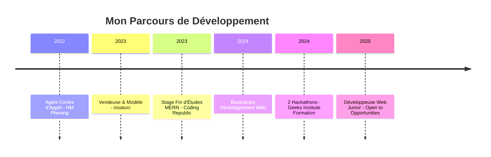

<div align="center">


<h3>💻 Développeuse Web Junior | MERN Stack Enthusiast</h3>

[](https://git.io/typing-svg)

<p>
  <a href="https://portfolio-eight-nu-v0qypdvlqi.vercel.app" target="_blank">
    
  </a>
  <a href="mailto:bensmail.fatimazahra.pro@gmail.com">
    
  </a>
  <a href="https://github.com/bensmailfati11">
    
  </a>
</p>

</div>

---

## 🙋‍♀️ À Propos de Moi

```javascript
const fatimaZahra = {
    location: "Casablanca, Maroc 🇲🇦",
    role: "Développeuse Web Junior",
    education: "Développement Web Full Stack",
    languages: ["JavaScript", "Python", "TypeScript", "HTML", "CSS"],
    frameworks: {
        frontend: ["React", "Tailwind CSS", "Three.js", "Framer Motion"],
        backend: ["Node.js", "Express", "Flask"],
        databases: ["MongoDB", "SQLite"]
    },
    currentFocus: "Building interactive web applications with modern tech stacks",
    lookingFor: "Opportunités de collaboration et d'apprentissage",
    funFact: "J'aime créer des expériences web immersives avec des animations 3D ✨"
};
```

---

## 🚀 Mes Projets Phares

<table>
  <tr>
    <td width="50%" valign="top">
      <h3 align="center">Task Manager PFE</h3>
      <br>
      <a href="https://github.com/bensmailfati11/TaskManagerPFE" target="_blank">
        
      </a>
      <br>
      <p align="center">
        
        
        
        
      </p>
      <p align="center">Application de gestion de tâches avec calendrier intégré. Développée lors de mon stage de fin d'études.</p>
    </td>
    <td width="50%" valign="top">
      <h3 align="center">Events Organizer API</h3>
      <br>
      <a href="https://github.com/bensmailfati11/Event-Organizer-API" target="_blank">
        
      </a>
      <br>
      <p align="center">
        
        
        
        
      </p>
      <p align="center">API REST complète avec authentification JWT et gestion de rôles (Admin/Organizer/Member).</p>
    </td>
  </tr>
  <tr>
    <td width="50%" valign="top">
      <h3 align="center">AI Chatbot</h3>
      <br>
      <a href="https://github.com/bensmailfati11/geeks-institute/tree/master/week_3/day_3/chatbot_project" target="_blank">
        
      </a>
      <br>
      <p align="center">
        
        
        
      </p>
      <p align="center">Chatbot intelligent propulsé par l'API OpenRouter avec interface conversationnelle moderne.</p>
    </td>
    <td width="50%" valign="top">
      <h3 align="center">Portfolio 3D</h3>
      <br>
      <a href="https://github.com/bensmailfati11/portfolio" target="_blank">
        
      </a>
      <br>
      <p align="center">
        
        
        
        
      </p>
      <p align="center">Portfolio interactif avec animations 3D, modèles Three.js et formulaire de contact EmailJS.</p>
    </td>
  </tr>
</table>

---

## 💻 Stack Technique

<div align="center">

### Frontend
<p>
  
</p>

### Backend & Databases
<p>
  
</p>

### Outils & DevOps
<p>
  
</p>

</div>

---

## 📊 Statistiques GitHub

<div align="center">
  
  
</div>

<div align="center">
  
</div>

<div align="center">
  
</div>

---

## 🎓 Formation & Certifications



**🏆 Formations & Bootcamps**
- ✅ Développement Web Full Stack
- ✅ MERN Stack (MongoDB, Express, React, Node.js)
- ✅ Python & Flask
- ✅ 2 Hackathons (Geeks Institute Formation)
- ✅ Méthodologie Agile & Git

---

## 📫 Me Contacter

<div align="center">

[](https://portfolio-eight-nu-v0qypdvlqi.vercel.app)
[](mailto:bensmail.fatimazahra.pro@gmail.com)
[](https://github.com/bensmailfati11)

<br>

**💼 Ouverte aux opportunités de collaboration et d'apprentissage !**

---

### 📈 Activité Récente

<!--START_SECTION:activity-->
<!--END_SECTION:activity-->

---


*"Code is like humor. When you have to explain it, it's bad." – Cory House*

</div>


